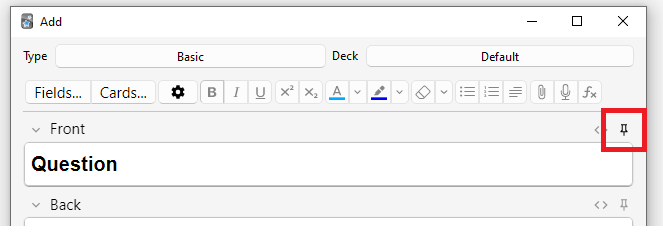

# Aggiunta/Modifica

<!-- toc -->

## Aggiunta di carte e di note

Ricorderai dalle [basi](getting-started.md) che in Anki si aggiungono note e non carte, le quali vengono invece generate da Anki. Fai clic sul pulsante "Aggiungi" nella [schermata principale](studying.md#mazzi) e si aprirà la schermata "Aggiungi Note".


Nella parte superiore sinistra della schermata viene mostrato il [tipo di nota](getting-started.md#tipi-di-nota) attuale. Se non riporta "Basilare", potresti aver aggiunto dei tipi di nota importando un mazzo condiviso. Il testo che segue presuppone che sia selezionato "Basilare".

Nella parte superiore destra della schermata viene mostrato il [mazzo](getting-started.md#mazzi) a cui verranno aggiunte le carte. Se desideri aggiungere le carte ad un nuovo mazzo, fai clic sul pulsante del nome del mazzo e quindi su "Aggiungi".

Sotto il tipo di nota sono presenti alcuni pulsanti e due aree chiamate rispettivamente "Fronte" e "Retro". Fronte e Retro sono chiamati [campi](getting-started.md#note-e-campi) e puoi aggiungerli, rimuoverli e rinominarli facendo clic sul pulsante "Campi..." soprastante.

Sotto i campi è presente un'altra area chiamata "Etichette". Le etichette sono termini che puoi associare alle note per facilitarne l'organizzazione e la ricerca. Puoi lasciare tale area vuota se lo desideri, oppure aggiungerne una o più, separate da uno spazio. Se l'area contiene

    vocabolario controlla_con_insegnante

...significa che la nota che aggiungerai avrà due etichette.

Una volta inserito del testo nel fronte e nel retro, puoi fare clic sul pulsante "Aggiungi" o premere <kbd>Ctrl</kbd>+<kbd>Invio</kbd> (<kbd>Comando</kbd>+<kbd>Invio</kbd> su Mac) per aggiungere la nota alla tua collezione. Eseguendo questa operazione verrà creata anche una carta e inserita nel mazzo scelto. Se desideri modificare una carta aggiunta recentemente, fai clic sul pulsante "Cronologia" per cercarla nella [schermata Sfoglia](browsing.md).

Per ulteriori informazioni sui pulsanti che si trovano tra il tipo di nota e i campi, consulta la sezione [modifica](editing.md).

### Controllo dei duplicati

Anki verifica l'unicità del primo campo, segnalandoti eventuali duplicati quando aggiungi due o più carte con lo stesso valore nel campo "Fronte", come ad esempio "mela". Questo controllo è limitato al tipo di nota attuale, pertanto se studi diverse lingue, due carte con lo stesso valore per il campo "Fronte" non verranno segnalate come duplicate purché il tipo di nota sia differente.

Per motivi di efficienza tale controllo non avviene in maniera automatica, ma la schermata Sfoglia dispone di una funzionalità chiamata "Trova duplicati" di cui puoi fare uso periodicamente.

### Apprendimento efficace

Le modalità di ripasso preferite variano da individuo a individuo, ma esistono alcuni concetti generali da tenere a mente. Un'introduzione eccellente è fornita da [questo articolo](https://super-memory.com/articles/20rules.htm) presente sul sito di SuperMemo. In particolare è consigliato:

- **Privilegiare la semplicità**: Carte più concise risultano più facili da ripassare. Sebbene tu possa essere tentato di includere molte informazioni "per sicurezza", il ripasso rischierebbe di diventare eccessivamente pesante.

- **Evitare di memorizzare senza capire**: Se stai studiando una lingua, cerca di evitare lunghe liste di parole. Il modo migliore per apprendere le lingue è nel contesto, il che significa vedere le parole utilizzate all'interno di una frase. Allo stesso modo, immagina di seguire un corso di informatica: qualora tentassi di memorizzare una montagna di acronimi, troveresti molto difficile fare progressi. Al contrario, dedicare tempo alla comprensione dei concetti sottesi agli acronimi ne facilita l'apprendimento. 

## Aggiunta di un tipo di nota

Mentre i tipi di nota basilari sono sufficienti per carte semplici che contengono una sola parola o una sola frase per lato, nel momento in cui ritieni di voler includere più di una informazione sul fronte o sul retro, è consigliabile suddividerle in più campi.

Potresti pensare "ma io voglio creare soltanto una carta, perché non posso semplicemente includere la traccia audio, l'immagine, il suggerimento e la traduzione nel campo Fronte?". Se preferisci farlo, nessun problema. Tuttavia lo svantaggio di questo approccio è che tutte le informazioni saranno aggregate. Se volessi ordinare le carte per suggerimento, non saresti in grado di farlo in quanto questi sono mischiati con gli altri contenuti. Inoltre, non saresti in grado di fare cose come spostare la traccia audio da Fronte a Retro, se non copiandola e incollandola manualmente per ogni nota. Separando i contenuti in campi distinti, renderai molto più facile modificare il layout delle tue carte in futuro.

Per creare un nuovo tipo di nota, seleziona "Strumenti → Gestisci tipi di nota" dalla schermata principale di Anki, quindi fai clic su "Aggiungi" per aggiungere il nuovo tipo di nota. Si aprirà una nuova schermata che ti darà la possibilità di scegliere un tipo di nota su cui basare quello nuovo. "Aggiungi" significa basare il nuovo tipo su uno di quelli predefiniti fornito da Anki. "Clona" significa basarlo su uno già presente nella collezione. Se per esempio hai già creato un tipo di nota per il vocabolario francese, potresti clonarlo durante la creazione di un tipo di nota per il vocabolario tedesco.

Dopo aver selezionato "OK", ti verrà chiesto di dare un nome al nuovo tipo. In questo caso il nome del materiale che stai studiando è una buona scelta: "Giapponese", "Cultura generale" e così via. Una volta scelto un nome, chiudi la schermata "Tipi di Note" e tornerai alla schermata Aggiungi Note.

## Personalizzazione dei campi

Per personalizzare i campi, fai clic sul pulsante  "Campi..." quando aggiungi o modifichi una nota, oppure quando il tipo di nota è selezionato nella schermata "Gestisci tipi di nota".


Puoi aggiungere, eliminare o rinominare i campi facendo clic sui pulsanti corrispondenti. Per modificare l'ordine in cui appaiono i campi in questa finestra e nella finestra di aggiunta delle note, utilizza il pulsante "Riposiziona". Una volta che hai selezionato tale pulsante, inserisci la posizione numerica desiderata per il campo in questione. Ad esempio, per spostare un campo in prima posizione, immetti "1".

Sebbene la probabilità che tu crei campi in inglese sia più bassa, è importante sottolineare l'importanza di evitare l'utilizzo di nomi come "Tags", "Type", "Deck", "Card" o "FrontSide" per i campi in quanto si tratta di [campi speciali](templates/fields.md#special-fields) e non funzionerebbero correttamente.

Le opzioni presenti in fondo alla schermata consentono di modificare diverse proprietà dei campi utilizzati quando aggiungi e modifichi le carte. _Non_ è in questa sezione che personalizzi ciò che appare sulle carte durante la ripetizione; per quello consulta la sezione [modelli](templates/intro.md).

- **Modifica carattere** ti consente di personalizzare il carattere e la dimensione utilizzati durante la modifica delle note. Questo è utile se vuoi ridurre la dimensione di informazioni di minore importanza o aumentare quella di caratteri stranieri difficili da leggere. Le modifiche apportate qui non influiscono su come le carte appaiono in fase di ripetizione: consulta la sezione [modelli](templates/intro.md) se desideri farlo. Se hai abilitato la funzionalità "scrivi la risposta", il testo digitato utilizzerà la dimensione del carattere definita qui. (Per informazioni su come modificare il carattere effettivo durante la digitazione della risposta, consulta la sezione [verifica della risposta](templates/fields.md#checking-your-answer)).

- **Ordina in base a questo campo…​** mostra questo campo nella colonna "Campo ordinamento" della schermata Sfoglia. Puoi utilizzarlo per ordinare le carte in base a quel campo, ma soltanto un campo alla volta può essere utilizzato per l'ordinamento.

- **Inverti direzione testo** è utile se studi lingue che mostrano il testo da destra a sinistra (RTL) come l'arabo o l'ebraico. Attualmente questa impostazione si applica soltanto alla modifica; per assicurarti che il testo venga visualizzato correttamente durante la ripetizione devi modificare il [modello](templates/styling.md#text-direction).

- **Utilizza di default l'editor HTML** è utile se preferisci modificare i campi in HTML.

- **Comprimi di default**. permette di mantenere i campi compressi per impostazione predefinita. L'animazione può essere disabilitata nelle [preferenze](preferences.md).

- **Escludi da ricerche non qualificate (più lento)** può essere utilizzato se non vuoi che il contenuto di un determinato campo appaia nelle ricerche non qualificate [(non limitate a un campo specifico)](searching.md#limiting-to-a-field).

Dopo aver aggiunto i campi, probabilmente vorrai aggiungerli al fronte o al retro delle carte; per maggiori informazioni su come farlo, consulta la sezione [modelli](templates/intro.md).

## Cambiare il mazzo o il tipo di nota

Durante l'aggiunta di una nota, puoi cambiare il tipo di nota o il mazzo utilizzato facendo clic rispettivamente sui pulsanti in alto a sinistra e a destra. La schermata che si apre ti permette non solo di selezionare un mazzo o un tipo di nota esistente ma anche di aggiungere nuovi mazzi e gestire i tipi di nota già esistenti.

## Organizing Content

### Using Decks Appropriately

[Decks](getting-started.md#mazzi) are designed to divide your content up into
broad categories that you wish to study separately, such as English, Geography,
and so on. You may be tempted to create lots of little decks to keep your
content organized, such as "my geography book chapter 1", or "food verbs", but
this is not recommended, for the following reasons:

- Lots of little decks may mean you end up seeing cards in a
  recognizable order. On older scheduler versions, new cards can only
  be introduced in deck order. And if you were planning to click on each deck
  in turn (which is slow), you will end up seeing all the "chapter 1" or
  "food verb" reviews together. This makes it easier to answer the
  cards, as you can guess them from the context, which leads to weaker
  memories. When you need to recall the word or phrase outside Anki,
  you won't always have the luxury of being shown related content first!

- While less of a problem than it was in earlier Anki versions,
  adding hundreds of decks may cause slowdowns, and very large deck
  trees with thousands of items can actually break the display of
  the deck list in Anki versions before 2.1.50.

### Using Tags

Instead of creating lots of little decks, it's a better idea to use tags
and/or fields to classify your content. Tags are a useful way to boost
search results, find specific content, and keep your collection
organized.
There are many ways of using tags and flags effectively, and
thinking in advance about how you want to use them will help you decide
what will work best for you.

Some people prefer using decks and subdecks to keep their cards organized,
but using tags have a big advantage over decks for that: you can add several
tags to a single note, but a single card can only belong to one deck, which
makes tags a more powerful and flexible categorization system than
decks in most cases. You can also organize tags in trees [in the same way as you can do for decks](getting-started.md#mazzi).

For example, instead of creating a "food verbs" deck, you could add those
cards to your main language study deck, and tag the cards with "food" and
"verb". Since each card can have multiple tags, you can do things like
[search](searching.md#tags-decks-cards-and-notes) for all verbs, or all
food-related vocabulary, or all verbs that are related to food.

You can add tags from the Edit window and from the [Browser](browsing.md), and you can also add,
delete, rename, or organize tags there. Please note that
tags work at [note](getting-started.md#note-e-campi) level, which means that when you tag a card that has siblings,
all the siblings will be tagged as well. If you need to tag a single card,
but not its siblings, you should consider using flags instead.

### Using Flags

Flags are similar to tags, but they will appear during study in the review
window, showing a colored flag icon on the upper right area of the screen.
You can also search for flagged cards in the Browse screen, rename flags
from the browser and create filtered decks from flagged cards, but unlike tags,
a single card can have only one flag at a time. Another important difference
is that flags work at [card](getting-started.md#carte) level, so flagging a card that has siblings
won't have any effect on the card's siblings.

You can flag / unflag cards directly while in review mode (by pressing
<kbd>CTRL</kbd> + <kbd>1-7</kbd> on Windows or <kbd>CMD</kbd> + <kbd>1-7</kbd> on Mac)
and from the [Browser.](browsing.md)

### The "Marked" Tag

Anki treats a tag called "marked" specially. There are options in the review
screen and browse screen to add and remove the "marked" tag. The review screen
will show a star when the current card's note has that tag. And cards are
shown in a different color in the browse screen when their note is marked.

Note: Marking is mainly left around for compatibility with older Anki
versions; most users will want to use [flags](editing.md#using-flags) instead.

### Using Fields

For those who like to stay very organized, you can add fields to your
notes to classify your content, such as "book", "page", and so on. Anki
supports searching in specific fields, which means you can do a search
for `"book:my book" page:63` and immediately find what you're looking
for.

### Custom Study and Filtered Decks

Using [custom study and filtered deck](filtered-decks.md) you can create
temporary decks out of search
terms. This allows you to review your content mixed together in a single
deck most of the time (for optimum memory), but also create temporary
decks when you need to focus on particular material, such as before a
test. The general rule is that if you always want to be able to study
some content separately, it should be in a normal deck; if you only
occasionally need to be able to study it separately (for a test, when
under a backlog, etc.), then filtered decks created from tags, flags,
marks or fields are better.

## Editing Features

The editor is shown when [adding notes](editing.md), [editing a note](studying.md#modifica-e-altro) during reviews, or [browsing](browsing.md).


On the top left are two buttons, which open the [fields](editing.md#personalizzazione-dei-campi) and
[cards](templates/intro.md) windows.

On the right are buttons that control formatting. Bold, italic and
underline work like they do in a word processing program. The next two
buttons allow you to subscript or superscript text, which is useful for
chemical compounds like H<sub>2</sub>O or simple mathematical equations like
x<sup>2</sup>. Then, there are two buttons to allow you to change text colour.

The rubber eraser button clears any formatting in the currently selected text — including the colour
of the text, whether the selected text is bold, etc. The next three buttons allow creating lists, text alignment and text indent.

You can use the paper-clip button to select audio, images, and videos from
your computer's hard drive and attach them to your notes. Alternatively, you
can copy the media onto your computer's clipboard (for instance, by
right-clicking an image on the web and choosing 'Copy Image') and paste
it into the field that you want to place it in. For more information
about media, please see the [media](media.md) section.

The microphone icon allows you to record from your computer's microphone
and attach the recording to the note.

The Fx button shows shortcuts to add MathJax or
[LaTeX](math.md) to your notes.

The \[…​\] buttons are visible when a cloze note type is selected.


The `</>` button allows editing the underlying HTML of a field.


Anki 2.1.45+ supports adjusting sticky fields directly from the editing screen.
If you click on the pin icon on the right of a field, Anki will not clear out
the field's content after a note is added. If you find yourself entering the
same content into multiple notes, you may find this useful. On previous Anki
versions, sticky fields were toggled from the Fields screen.



Most of the buttons have shortcut keys. You can hover the mouse cursor
over a button to see its shortcut.

When pasting text, Anki will keep most formatting by default. If you
hold down the <kbd>Shift</kbd> key while pasting, Anki will strip most of the
formatting. Under Preferences, you can toggle "Paste without shift
key strips formatting" to modify the default behaviour.

## Cloze Deletion

'Cloze deletion' is the process of hiding one or more words in a
sentence. For example, if you have the sentence:

    Canberra was founded in 1913.

…​and you create a cloze deletion on "1913", then the sentence would
become:

    Canberra was founded in [...].

Sometimes sections that have been removed in this fashion are said to be
'occluded'.

For more information on why you might want to use cloze deletion, see
Rule 5 [here](https://super-memory.com/articles/20rules.htm).

Anki provides a special cloze deletion type of note, to make creating
clozes easy. To create a cloze deletion note, select the Cloze note
type, and type some text into the "Text" field. Then drag the mouse over
the text you want to hide to select it, and click the \[…​\] button.
Anki will replace the text with:

    Canberra was founded in {{c1::1913}}.

The "c1" part means that you have created one cloze deletion on the
sentence. You can create more than one deletion if you'd like. For
example, if you select Canberra and click \[…​\] again, the text will
now look like:

    {{c2::Canberra}} was founded in {{c1::1913}}.

When you add the above note, Anki will create two cards. The first card
will show:

    Canberra was founded in [...].

…​on the question, with the full sentence on the answer. The other card
will have the following on the question:

    [...] was founded in 1913.

You can also elide multiple sections on the same card. In the above
example, if you change c2 to c1, only one card would be created, with
both Canberra and 1913 hidden. If you hold down <kbd>Alt</kbd> (<kbd>Option</kbd> on a Mac)
while creating a cloze, Anki will automatically use the same number
instead of incrementing it.

Cloze deletions don't need to fall on word boundaries, so if you select
"anberra" rather than "Canberra" in the above example, the question
would appear as "C\[…​\] was founded in 1913", giving you a hint.

You can also give yourself hints that don't match the text. If you
replace the original sentence with:

    Canberra::city was founded in 1913

…​and then press \[…​\] after selecting "Canberra::city", Anki will
treat the text after the two colons as a hint, changing the text into:

    {{c1::Canberra::city}} was founded in 1913

When the card comes up for review, it will appear as:

    [city] was founded in 1913.

For information on testing your ability to type in a cloze deletion
correctly, please see the section on [typing answers](templates/fields.md#checking-your-answer).

From version 2.1.56, nested cloze deletions are supported. For example, the following is valid:

    {{c1::Canberra was {{c2::founded}}}} in 1913

The inner cloze is entirely nested within the outer. There is no support for partial overlaps, such as:

    [...] founded in 1913 -> Canberra was
    Canberra [...] in 1913 -> was founded

with the word "was" appearing in both deletions.

Prior to version 2.1.56, if you need to create clozes from overlapping text, add another Text
field to your cloze, add it to the [template](templates/intro.md), and then when
creating notes, paste the text into two separate fields, like so:

    Text1 field: {{c1::Canberra was founded}} in 1913

    Text2 field: {{c2::Canberra}} was founded in 1913

The default cloze note type has a second field called Extra, that is
shown on the answer side of each card. It can be used for adding some
usage notes or extra information.

The cloze note type is treated specially by Anki, and cannot be created
based on a regular note type. If you wish to customize it, please make
sure to clone the existing Cloze type instead of another type of note.
Things like formatting can be customized, but it is not possible to add
extra card templates to the cloze note type.

## Image Occlusion

Anki 23.10+ supports Image Occlusion cards natively. An Image
Occlusion (IO) note is a special case of cloze deletion based on images
instead of text, and allows you to create cards that hide some parts
of an image, testing your knowledge of that hidden information.


### Adding an image

To add IO cards to your collection, open the Add screen, click on "Type"
and choose "Image Occlusion" from the list of built-in note types.
Then, click on "Select Image" to load an image file saved on your
computer's hard drive, or on "Paste image from clipboard"
if you have an image copied to the clipboard.

### Adding IO cards

After loading an image, the IO editor will open. Click on the
icons on the left to add as many areas to your image as you want.
There are three basic shapes to choose from:

- Rectangle
- Ellipse
- Polygon

You can also choose between two different IO modes for each note:

- **Hide All, Guess One**: All areas are hidden and only one
  area at a time is revealed while learning.
- **Hide One, Guess One**: Only one area at a time is hidden
  and will be revealed during learning. The other areas will be visible.


Once you're done, click on the "Add" button, at the bottom of the screen.
Anki will add a card for each shape or group of shapes you added in the previous step,
and you can start reviewing them normally.

## Editing IO notes

You can edit your IO notes by clicking on "Edit" while reviewing,
or directly from the browser. There are several tools that you
can use. Of note:

- Select: It allows you selecting one or more shapes to move,
  resize, delete or group them.
- Zoom: You can freely move the image and zoom in or out using the mouse wheel.
- Shapes (Rectangle, Ellipse or Polygon): Use them to add new shapes / cards.
- Text: It adds text areas to your image. These text areas can be moved,
  resized or deleted, but no card will be created when you use this tool.
- Undo / Redo.
- Zoom In / Out - Reset zoom.
- Toggle Translucency: Use this tool to temporarily view the hidden areas.
- Delete: Use this tool to delete selected shapes and text areas. Please
  note that deleting a shape won't delete its associated card automatically;
  you will need to use Tools>Empty Cards afterwards, the same as
  with regular cloze deletions.
- Duplicate.
- Group selection: Use this tool to create a cluster of shapes, which will
  allow you to move, resize or delete them simultaneously. Please note that
  two or more single shapes will create only one card once grouped.
- Ungroup selection: Select a group and then click this button to make each shape independent again.
- Alignment: This tool can be used to align your shapes / text areas as desired.

While reviewing IO Cards a "Toggle Masks" button will appear just below the image.
This button will temporary clear all shapes of the note when using "Hide All, Guess One" mode.

## Inputting Foreign Characters and Accents

All modern computers have built-in support for typing accents and
foreign characters, and multiple ways to go about it. The method we
recommend is by using a keyboard layout for the language you want to learn.

Languages with a separate script like Japanese, Chinese, Thai, and so on,
have their own layouts specific to that language.

European languages that use accents may have their own layout, but can
often be typed on a generic "international keyboard" layout. These work
by typing the accent, then the character you want accented - e.g. an
apostrophe (') then the letter a (a) gives á.

To add the international keyboard on Windows machines, please see
<https://thegeekpage.com/how-to-add-us-international-keyboard-in-windows-10/>

To add it on Macs, please see
<http://www.macworld.com/article/1147039/os-x/accentinput.html>

Keyboards for a specific language are added in a similar way, but we can
not cover them all here. For more information, please try searching
Google for "input Japanese on a mac", "type Chinese on Windows 10", and
so on.

If you are learning a right-to-left language, there are lots of other
things to consider. Please see [this page](http://dotancohen.com/howto/rtl_right_to_left.html) for more
information.

The toolkit on which Anki is built has trouble dealing with a few input
methods, such as holding down keys to select accented characters on macOS,
and typing characters by holding down the <kbd>Alt</kbd> key and typing a
numeric code on Windows.

## Unicode Normalization

Text like `á` can be represented in multiple ways on a computer, such as
using a specific code for that symbol, or by using a standard `a` and then
another code for the accent on top. This causes problems when mixing input
from different sources, or using different computers - if your computer
handles keyboard input in one form, but the content is stored in a different
form, it will not match when searching, even though the end result appears
identical.

To ensure content can easily be found in searches, Anki normalizes the text
to a standard form. For most users this process is transparent, but if you
are studying certain material like archaic Japanese symbols, the normalization
process can end up converting them to a more modern equivalent.

If you want character variants preserved, the following in the [debug console](./misc.md)
will turn off normalization:

```python
mw.col.conf["normalize_note_text"] = False
```

Any content added after that will remain untouched. The trade-off is that you may
find it difficult to search for the content if you're switching between operating
systems, or pasting content from mixed sources.
