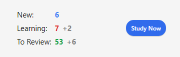

# Studio

<!-- toc -->

Una volta che hai trovato un mazzo di tuo gradimento o che hai aggiunto delle note, è giunto il momento di iniziare a studiare.

## Mazzi

Lo studio su Anki è limitato al mazzo attualmente selezionato, compresi eventuali sottomazzi contenuti al suo interno.

Nella schermata dei mazzi sono presenti mazzi e sottomazzi organizzati in una lista, e sono visualizzate anche le carte [Nuove, In apprendimento e Di ripasso](getting-started.md#tipologie-di-carta) in un determinato giorno.

Facendo clic su un mazzo lo si rende il "mazzo attuale" e Anki passa automaticamente alla schermata di studio. Puoi tornare all'elenco dei mazzi in qualsiasi momento per selezionare un altro mazzo, accedendo a "Mazzi" nella parte superiore della finestra principale o, in alternativa, accedere a "Strumenti -> Studia mazzo" per selezionare un nuovo mazzo dalla tastiera oppure premere il tasto <kbd>s</kbd> per studiare il mazzo attualmente selezionato.

Facendo clic sull'icona a forma di ingranaggio alla destra di un determinato mazzo, puoi decidere di rinominarlo, eliminarlo, modificarne le [opzioni](deck-options.md) o [esportarlo](exporting.md).

## Panoramica dello studio

Facendo clic su un mazzo per studiarlo apparirà una schermata che mostra quante carte sono da studiare per il giorno attuale. Questa schermata è chiamata "panoramica del mazzo":

Le carte sono suddivise in [tre categorie](getting-started.md#tipologie-di-carta): Nuove, In apprendimento e Di ripasso. Se hai attivato l'opzione "Seppellisci carte sorelle" nelle impostazioni del mazzo, il numero delle eventuali carte sepolte verrà mostrato in grigio:

Per iniziare una sessione di studio, fai clic sul pulsante **Studia adesso** e Anki ti mostrerà le carte da ripetere una alla volta, fino all'esaurimento di quelle previste per oggi.

Durante la sessione di studio, puoi tornare alla panoramica premendo il tasto <kbd>s</kbd>.

## Domande

Quando viene mostrata una carta, inizialmente è visibile soltanto la domanda. Dopo aver riflettuto sulla risposta, puoi fare clic sul pulsante **Mostra risposta** o premere la barra spaziatrice. A questo punto ti verrà mostrata la risposta. Non preoccuparti se ci vuole un po' di tempo per ricordare la risposta, ma come regola generale, se non riesci a rispondere entro circa 10 secondi, è probabilmente meglio mostrare la risposta anziché continuare a sforzarti di ricordarla.

Una volta mostrata la risposta, puoi confrontarla con quella a cui avevi pensato e comunicare ad Anki quanto bene l'hai ricordata. Se non sei sicuro di poter fare un confronto accurato, puoi far sì che Anki [ti richieda di digitare la risposta](templates/fields.md#checking-your-answer) anziché mostrartela soltanto.

## Carte in apprendimento/riapprendimento

Quando apprendi nuove carte o riapprendi quelle dimenticate, Anki mostra le carte una o più volte per aiutarti a memorizzarle. Ciascuna di queste presentazioni è chiamata "passo di apprendimento" e, per impostazione predefinita, sono presenti due passi di apprendimento: 1 minuto e 10 minuti. Puoi modificare il numero di passi e l'intervallo tra di essi nelle [opzioni del mazzo](deck-options.md#new-cards).

Durante una sessione di studio sono presenti quattro pulsanti di valutazione:

- **Ripeti** fa tornare la carta al primo passo.

- **Difficile** ripete il passo attuale.
  - Se la carta si trova sul primo (e unico) passo, l'intervallo è incrementato del 50%, ma mai superiore ad un giorno, rispetto al passo.
  - Se la carta si trova sul primo passo e ne hai configurati più di uno, l'intervallo è la media tra Ripeti e Normale, ovvero la media dei primi due passi.
  - Se la carta si trova su un qualsiasi passo successivo, Difficile ripete l'intervallo precedente.
 
- **Normale** sposta la carta al [passo successivo](deck-options.md#learning-steps). Se la carta si trovava sul passo finale, viene convertita in una "carta di ripasso" (viene "promossa"). Per impostazione predefinita, dopo aver raggiunto il passo di apprendimento finale, la carta viene mostrata nuovamente il giorno successivo e poi a intervalli sempre più lunghi (vedi la sezione successiva).

- **Facile** converte immediatamente la carta in una carta di ripasso, anche se non sono stati completati tutti i passi. [Per impostazione predefinita](deck-options.md#easy-interval) la carta viene mostrata nuovamente dopo 4 giorni e poi a intervalli sempre più lunghi. Con il pianificatore v1, il pulsante "Facile" non viene mostrato in modalità di riapprendimento poiché avrebbe lo stesso intervallo di "Normale", mentre con il [pianificatore v2+](https://faqs.ankiweb.net/the-anki-2.1-scheduler.html) (inglese) incrementa l'intervallo di 1 giorno.

Quando le carte vengono visualizzate per la prima volta, iniziano dal primo passo. Questo significa che rispondere con **Normale** ad una carta per la prima volta la mostrerà ancora una volta entro 10 minuti, saltando il passo iniziale di 1 minuto. Se invece rispondi con **Ripeti**, la carta si ripresenterà dopo 1 minuto.

Puoi usare i tasti <kbd>1</kbd>, <kbd>2</kbd>, <kbd>3</kbd> e <kbd>4</kbd> sulla tastiera per selezionare un 
pulsante specifico, dove <kbd>1</kbd> corrisponde a **Ripeti**. Premendo la <kbd>Barra spaziatrice</kbd> o <kbd>Invio</kbd> si seleziona il pulsante **Normale**.

Se non ci sono altre carte da mostrare, Anki mostrerà nuovamente le carte da ripetere anche se il loro intervallo non è trascorso del tutto. Se preferisci attendere il completamento dell'intervallo puoi modificare tale comportamento accedendo a [Preferenze>Ripetizioni>Limite di studio anticipato](preferences.md).

## Carte di ripasso

Quando una carta già appresa è pronta per essere ripassata, sono presenti quattro pulsanti che ti permettono di valutare la tua risposta:

- **Ripeti** indica che la tua risposta è errata e fa sì che in futuro la carta venga mostrata più frequentemente. Questo tipo di carta viene considerata una carta "con errore". Consulta la sezione [errori](deck-options.md#lapses) per maggiori informazioni su come viene gestita tale carta.

- **Difficile** per impostazione predefinita mostra la carta con un [intervallo leggermente più lungo](deck-options.md#hard-interval)
  rispetto alla volta precedente e fa sì che in futuro venga mostrata più frequentemente.

- **Normale** comunica che l'intervallo precedente era corretto e che la facilità della carta non necessita di modifiche. Con la [facilità iniziale predefinita](deck-options.md#starting-ease) la carta verrà mostrata nuovamente circa 2 volte e mezzo più tardi rispetto alla volta precedente, per cui se in precedenza hai atteso 10 giorni per rivedere la carta, il prossimo intervallo sarà di circa 25 giorni.

- **Facile** comunica che l'intervallo è troppo breve. La carta verrà pianificata [molto più avanti nel futuro rispetto a "Normale"](deck-options.md#easy-bonus) e mostrata meno frequentemente in futuro. Poiché "Facile" aumenta rapidamente l'intervallo, è consigliabile utilizzarlo solo per le carte più facili; in generale dovresti tendere a rispondere "Normale".

Come per le carte in apprendimento, puoi utilizzare i tasti <kbd>1</kbd>, <kbd>2</kbd>, <kbd>3</kbd> e <kbd>4</kbd> sulla tastiera per selezionare una risposta. Premendo la <kbd>Barra spaziatrice</kbd> o <kbd>Invio</kbd> si seleziona il pulsante **Normale**.

Per saperne di più sul funzionamento dell'algoritmo, consulta la sezione [Opzioni del mazzo](deck-options.md) e la [FAQ](https://faqs.ankiweb.net/what-spaced-repetition-algorithm.html) (inglese).

## Conteggi delle carte programmate

Quando viene mostrata solo la domanda, nella parte inferiore della schermata sono presenti tre numeri, come ad esempio 6 + 9 + 59. Questi indicano rispettivamente le carte nuove (blu), quelle in apprendimento (arancione) e quelle di ripasso (verde). Se preferisci non vedere questi numeri, puoi disattivarli nelle [preferenze](preferences.md).

Con il pianificatore v1, i numeri indicano le _ripetizioni_ necessarie per completare tutte le carte in quella coda e non il numero di _carte_. Se hai configurato più di un passo per le carte "con errori", il numero aumenta di più di uno quando sbagli una ripetizione, poiché tale carta necessita di essere mostrata più volte.

A partire dal [pianificatore v2](https://faqs.ankiweb.net/the-anki-2.1-scheduler.html) (inglese), invece, i numeri indicano il conteggio delle _carte_, quindi il numero aumenta sempre di uno indipendentemente dai passi rimanenti.

Quando viene mostrata la risposta, sopra ciascun pulsante appare una stima della prossima data di presentazione della carta. Se preferisci non vedere queste stime, puoi disattivarle nelle [preferenze](preferences.md).

## Fattore di sfumatura

Selezionando un pulsante di facilità su una carta di ripasso, viene applicata una piccola quantità di "sfumatura" casuale. Lo scopo è evitare che le carte aggiunte contemporaneamente e valutate in maniera simile rimangano aggreggate e vengano mostrate nello stesso giorno. Questa sfumatura è visibile sui pulsanti di valutazione quando è abilitato il [pianificatore v3](https://faqs.ankiweb.net/the-2021-scheduler.html) (inglese), per cui se utilizzi una versione precedente e noti una leggera discrepanza tra la tua selezione e gli intervalli effettivi delle carte, la causa è probabilmente questa.

Anche alle carte in apprendimento viene applicato un intervallo supplementare fino a 5 minuti per evitare che vengano mostrate nello stesso ordine, ma ciò non è visibile sui pulsanti di valutazione. Non è possibile disattivare questa funzionalità.

## Modifica e altro

In basso a sinistra è presente un pulsante chiamato **Modifica** che ti permette di modificare la nota attuale. Una volta terminata la modifica ritorni alla sessione di studio. La schermata di modifica è molto simile a quella di [aggiunta delle note](editing.md).

In basso a destra, invece, è presente un pulsante chiamato **Altro**, che permette di effettuare operazioni aggiuntive sulla carta o nota attuale:

- [**Assegna bandiera alla carta**](editing.md#using-flags): Aggiunge un contrassegno colorato (bandiera) alla carta o lo disattiva. Le bandiere appaiono durante lo studio e le carte contrassegnate con una bandiera possono essere ricercate nella schermata Sfoglia. Questa funzionalità è utile quando vuoi intraprendere una qualche azione sulla carta in un secondo momento, come ad esempio la ricerca di una parola una volta tornato a casa. Se utilizzi Anki 2.1.45 o versioni successive, puoi anche rinominare le bandiere dalla [schermata Sfoglia](browsing.md).

- **Seppellisci carta / nota**: Nasconde una carta o tutte le carte della nota, escludendole dalla ripetizione fino al giorno successivo (se desideri disseppellire le carte prima di allora, puoi fare clic sul pulsante "Disseppellisci" nella schermata [panoramica del mazzo](studying.md#panoramica-dello-studio)). Questa funzionalità è utile se al momento non riesci a rispondere alla carta o se preferisci tornarci in un altro momento. La sepoltura può anche [avvenire automaticamente](studying.md#carte-sorelle-e-sepoltura) per carte della stessa nota.
  
  Con il vecchio pianificatore, se le carte erano in fase di apprendimento quando venivano seppellite, le stesse venivano spostate nuovamente nella coda delle nuove carte o nella coda di ripasso prima di essere sepolte.

  Con la [versione 2.1 del pianificatore](https://faqs.ankiweb.net/the-anki-2.1-scheduler.html) (inglese) seppellire le carte non reimposta i passi di apprendimento di una carta.

- **Dimentica carta**: Sposta la carta attuale alla [fine della coda delle carte nuove](browsing.md#cards).

  A partire da Anki 2.1.50, l'ordine originale di una nuova carta viene memorizzato quando la si studia per la prima volta con il pianificatore v3. L'opzione "Ripristina posizione originale" ti consente di ripristinare la carta alla sua posizione originale quando la dimentichi.

  L'opzione "Azzera conteggio di ripetizioni ed errori", se abilitata, azzera il conteggio delle ripetizioni ed errori della carta, ma non rimuove la cronologia delle ripetizioni mostrata in basso nella schermata delle informazioni sulla carta.

- **Imposta data di scadenza**: Inserisce le carte nella coda di ripasso e [le programma per essere riviste in una data specifica](browsing.md#cards).

- **Sospendi carta / nota**: Nasconde una carta o tutte le carte della nota, escludendole dalla ripetizione fino a quando non le rimuovi manualmente  dalla sospensione (facendo clic sul pulsante "sospendi" nella schermata Sfoglia). Utile se vuoi evitare di ripassare la nota per un po' di tempo ma non vuoi eliminarla.
Con il vecchio pianificatore, se le carte erano in fase di apprendimento quando venivano sospese, le stesse venivano spostate nuovamente nella coda delle nuove carte o nella coda di ripasso prima di essere sospese.

  Con la [versione 2.1 del pianificatore](https://faqs.ankiweb.net/the-anki-2.1-scheduler.html) (inglese) la sospensione delle carte non reimposta i passi di apprendimento di una carta.

- **Opzioni**: Modifica le [opzioni](deck-options.md) per il mazzo attuale.

- **Info carta**: Mostra le [statistiche](stats.md#card-info) sulla carta.

- **Info carta precedente**: Mostra le [statistiche](stats.md#card-info) sulla carta precedente.

- [**Contrassegna nota**](editing.md#the-marked-tag): Aggiunge l'etichetta "marked" (contrassegnato/a) alla nota attuale, permettendoti di trovarla facilmente nella schermata Sfoglia. Questa funzionalità è simile all'assegnazione di bandiere alle singole carte, ma utilizza un'etichetta, per cui se la nota contiene più carte, una ricerca con l'etichetta in questione mostrerà tutte le carte che la possiedono. Per la maggior parte degli utenti è preferibile utilizzare le bandiere.

- **Crea copia**: Crea e apre un [duplicato](browsing.md#finding-duplicates) della nota attuale nella schermata di modifica, che può quindi essere modificata per creare variazioni di una determinata carta.
  Per impostazione predefinita, la carta duplicata, o copia, viene creata nello stesso mazzo della nota originale.

- **Elimina nota**: Elimina la nota e tutte le sue carte.

- **Ripeti audio**: Se la carta contiene una traccia audio sul lato frontale o sul retro, la riproduce nuovamente.

- **Metti audio in pausa**: Mette in pausa l'audio in riproduzione.

- **Audio -5s / +5s**: Consente di andare indietro o avanti di 5 secondi nell'audio in riproduzione.

- **Registra voce**: Registra la tua voce con il microfono al fine di controllare la tua pronuncia. La registrazione è temporanea e viene eliminata quando passi alla carta successiva. Se desideri aggiungere una traccia audio a una carta in modo permanente, puoi farlo nella schermata di modifica.

- **Riproduci voce**: Riproduce la registrazione precedente della tua voce (presumibilmente dopo aver mostrato la risposta).

## Ordine di presentazione

Durante lo studio vengono presentate le carte del mazzo selezionato e di eventuali sottomazzi in esso contenuti. Pertanto, se selezioni il mazzo "Francese", ti verranno mostrati anche i sottomazzi "Francese::Vocabolario" e "Francese::Il mio libro di testo::Lezione 1".

Il modo in cui Anki recupera le carte dai mazzi dipende dal pianificatore utilizzato:

- Con il pianificatore v1, quando un mazzo contiene dei sottomazzi, le carte vengono recuperate [a turno da ciascun mazzo](studying.md#ordine-di-presentazione).

- Con il [pianificatore v2](https://faqs.ankiweb.net/the-anki-2.1-scheduler.html) (inglese),
  quando un mazzo contiene dei sottomazzi, le carte vengono recuperate da tutti i sottomazzi contemporaneamente.
  Il limite di ripetizione dei sottomazzi viene ignorato; si applica solo il limite del mazzo che hai selezionato.

- Con il [pianificatore v3](https://faqs.ankiweb.net/the-2021-scheduler.html) (inglese)
  viene applicato anche il limite di ciascun sottomazzo e non è necessario che le carte vengano presentate in ordine di mazzo.
  Consulta la sezione [opzioni del mazzo](deck-options.md#review-sort-order) per maggiori informazioni.

Per impostazione predefinita, le carte nuove vengono recuperate dai mazzi in ordine alfabetico. Nell'esempio sopracitato, quindi, verrebbero recuperate prima le carte dal mazzo "Francese", poi dal mazzo "Il mio libro di testo", e infine dal mazzo "Vocabolario". Puoi sfruttare questa peculiarità per controllare l’ordine di presentazione delle carte, posizionando quelle ad alta priorità in mazzi che appaiono più in alto nella lista. Quando i computer ordinano il testo in ordine alfabetico, il carattere "-" precede i caratteri alfabetici, e "\~" li segue. Potresti quindi chiamare il mazzo "-Vocabolario" per far sì che le carte in esso contenute appaiano per prime e chiamare l'altro mazzo "\~ Il mio libro di testo" per forzare le carte in esso contenute ad apparire dopo tutto il resto.

Le carte nuove e di ripasso vengono recuperate separatamente, senza aspettare che entrambe le code siano vuote prima di passare al mazzo successivo, per cui è possibile che ti vengano mostrate carte nuove da un mazzo mentre studi le carte di ripasso da un altro mazzo o viceversa. Se non lo desideri, puoi fare clic direttamente sul mazzo che vuoi studiare invece che su uno dei mazzi genitore.

Poiché le carte in apprendimento hanno una certa urgenza temporale, vengono recuperate da tutti i mazzi contemporaneamente e presentate nell'ordine in cui sono programmate.

Per controllare l'ordine di presentazione delle ripetizioni di un determinato mazzo o per cambiare la presentazione delle carte nuove da ordinata a casuale, consulta le [opzioni del mazzo](deck-options.md). Per un ordinamento più preciso delle carte nuove puoi cambiare l'ordine nella schermata [Sfoglia](browsing.md).

## Carte sorelle e sepoltura

Come ricorderai dalle [basi](getting-started.md), per ogni informazione che aggiungi può venire creata più di una carta, come per esempio una carta fronte→retro e una retro→fronte, oppure due diverse cancellazioni dallo stesso testo.
Queste carte correlate vengono chiamate "sorelle".

Quando rispondi a una carta che ha delle sorelle, puoi impedire che le sue sorelle vengano mostrate nella stessa sessione di studio "seppellendole" automaticamente. Le carte sepolte restano escluse dalla ripetizione fino all'inizio del giorno successivo oppure fino a quando non le disseppellisci manualmente usando il pulsante "Disseppelisci" presente in fondo alla schermata [Panoramica dello studio](studying.md#panoramica-dello-studio). La sepoltura delle sorelle avviene anche se queste non si trovano nello stesso mazzo (ad esempio, se utilizzi la funzionalità [Sovrascrivi mazzo](templates/intro.md)).

Puoi attivare la sepoltura dalla schermata [Opzioni del mazzo](deck-options.md); sono presenti impostazioni separate per le carte nuove e per quelle di ripasso.

Soltanto le sorelle che sono carte nuove o di ripasso vengono seppellite, mentre le carte in apprendimento non vengono nascoste, poiché per queste il tempo è un fattore critico. D'altra parte, quando studi una carta in apprendimento, eventuali sorelle nuove o di ripasso vengono sepolte.

N.B.: Una carta non può essere sepolta e sospesa contemporaneamente. Sospendere una carta sepolta la disseppellisce. Da Anki 2.1.49 in poi, non è possibile seppellire una carta sospesa, mentre nelle versioni precedenti viene annullata la sospensione.

## Scorciatoie da tastiera

La maggior parte delle operazioni comuni in Anki è associata a delle scorciatoie da tastiera, spesso individuabili nell'interfaccia: le voci di menù mostrano le scorciatoie accanto al loro nome e posizionando il cursore del mouse su un pulsante, generalmente mostra la relativa scorciatoia in un riquadro.

Durante lo studio, sia il tasto <kbd>Barra spaziatrice</kbd> che <kbd>Invio</kbd> mostrano la risposta. Una volta visualizzata la risposta, puoi utilizzare la <kbd>Barra spaziatrice</kbd> o <kbd>Invio</kbd> per selezionare il pulsante "Normale". I tasti da <kbd>1</kbd> a <kbd>4</kbd> permettono di selezionare un pulsante di valutazione specifico. Molti utenti trovano conveniente rispondere alla maggior parte delle carte con la <kbd>Barra spaziatrice</kbd> e tenere un dito su <kbd>1</kbd> per quando si dimenticano.

La voce "Studia mazzo" nel menù Strumenti consente di passare rapidamente ad un mazzo utilizzando la tastiera e puoi anche attivarla premendo il tasto "/". Una volta aperta, mostra tutti i tuoi mazzi e un filtro nella parte superiore. Man mano che digiti i caratteri, vengono mostrati soltanto i mazzi che contengono i caratteri digitati. Puoi aggiungere uno spazio per separare più termini di ricerca e verranno mostrati soltanto i mazzi che corrispondono a tutti i termini, per cui sia "gia 1" che "one1 gia" corrisponderebbero ad un mazzo chiamato "Giapponese::Lezione1".

## Restare indietro

Se resti indietro nelle ripetizioni, viene data priorità alle carte in attesa da più tempo, mostrandole in ordine casuale fino al raggiungimento del limite giornaliero di ripetizioni. Tale ordinamento assicura che nessuna carta venga trascurata a tempo indeterminato, ma implica che se aggiungi nuove carte queste non verranno visualizzate finché non avrai smaltito l'arretrato.

Per modificare l'ordine delle ripetizioni scadute puoi creare un [mazzo filtrato](filtered-decks.md).

Quando rispondi a carte in attesa da molto tempo, il ritardo viene preso in considerazione per determinare il momento successivo in cui mostrare una carta. Per maggiori informazioni, consulta la sezione sull'[algoritmo](https://faqs.ankiweb.net/due-times-after-a-break.html) di ripetizione dilazionata di Anki.
